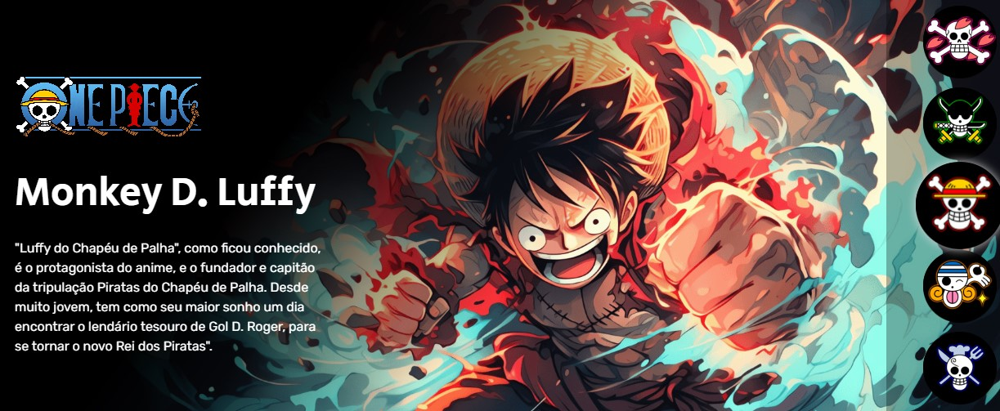

<h1 align="center">
    
</h1>

## 🚀Começando
Trata-se de uma Landing page onde você consegue selecionar o personagem desejavel através de botões e ler um pouco sobre cada um. Para quem quiser ver melhor, [clique aqui](https://matheusandraderibeiro.github.io/one-piece/).

## 📖 Sobre
Sua funcionalidade se baseia em adição e remoção da classe "selecionado" dos personagens e botões, onde apenas quem possui essa classe é visível para o usuário, deste modo, a cada seleção feita ela é realocada o que permite a visualização de todos os personagens um de cada vez.

Tudo o que envolve o projeto foi pensado antes de ser executado, ou seja, sua lógica, estrutura e estilização foram bem planejados a fim de trazer um melhor resultado final para quem vê e de entendimento claro na leitura do código.

Por mais que seja simples isso não significa que sejá fácil, sua estrutura foi dividida em duas partes, sendo uma delas o seu conteúdo principal e a outra, uma lista de botões por onde o usuário fará a seleção. Em termos de estilização, os arquivos css foram separados a fim de não ficarem muito grandes e bagunçados, cada arquivo é sobre uma das duas partes do código o que facilita a achar uma classe específica e na manutenção, caso seja alterado.

## 🔧Instalação
O projeto não tem nenhum requisito para rodar na sua maquina, basta baixar e usar.

## ✒️ Autores
Este site foi feito no evento do Dev em Dobro.
